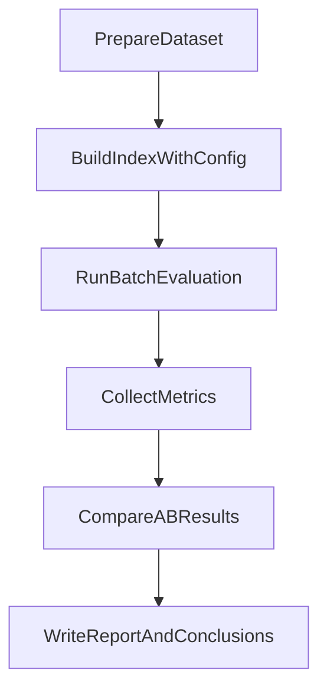

# RAG量化评测执行方案

## 目标与对比项

- 建立两类核心 A/B 实验：
  - `chunk` 策略对比：例如 `(400,40)` 基线 vs `(300,30)` vs `(600,60)`。
  - `BM25` 对比：混合检索（当前）vs 近似纯向量（`HYBRID_ALPHA=1.0`）。
- 评测输出三类指标：检索质量、回答质量、性能指标。
- 形成一份可复现报告（实验配置、结果表、结论、下一步优化建议）。

## 关键代码位置（用于落地）

- 分块参数定义：[d:/code/Rag_chat/Local_Pdf_Chat_RAG-main/Local_Pdf_Chat_RAG-main/config.py](d:/code/Rag_chat/Local_Pdf_Chat_RAG-main/Local_Pdf_Chat_RAG-main/config.py)
- 分块实现：[d:/code/Rag_chat/Local_Pdf_Chat_RAG-main/Local_Pdf_Chat_RAG-main/core/text_splitter.py](d:/code/Rag_chat/Local_Pdf_Chat_RAG-main/Local_Pdf_Chat_RAG-main/core/text_splitter.py)
- 建库入口（会触发分块、向量索引、BM25索引）：[d:/code/Rag_chat/Local_Pdf_Chat_RAG-main/Local_Pdf_Chat_RAG-main/rag_demo.py](d:/code/Rag_chat/Local_Pdf_Chat_RAG-main/Local_Pdf_Chat_RAG-main/rag_demo.py)
- 检索主流程（hybrid合并、BM25调用）：[d:/code/Rag_chat/Local_Pdf_Chat_RAG-main/Local_Pdf_Chat_RAG-main/core/retriever.py](d:/code/Rag_chat/Local_Pdf_Chat_RAG-main/Local_Pdf_Chat_RAG-main/core/retriever.py)
- 问答主流程（便于总耗时/生成质量打点）：[d:/code/Rag_chat/Local_Pdf_Chat_RAG-main/Local_Pdf_Chat_RAG-main/core/generator.py](d:/code/Rag_chat/Local_Pdf_Chat_RAG-main/Local_Pdf_Chat_RAG-main/core/generator.py)
- API入口（可做自动化批评测）：[d:/code/Rag_chat/Local_Pdf_Chat_RAG-main/Local_Pdf_Chat_RAG-main/api_router.py](d:/code/Rag_chat/Local_Pdf_Chat_RAG-main/Local_Pdf_Chat_RAG-main/api_router.py)

## 指标设计（先简后全）

- 检索质量：
  - `Hit@k`：正确证据文档是否出现在 Top-k。
  - `MRR`：首个命中的倒数排名。
- 回答质量（低成本可执行）：
  - `AnswerSuccessRate`：人工 0/1 标注“是否正确回答核心问题”。
  - `CitationMatchRate`：回答引用来源是否包含正确文档/URL。
- 性能指标：
  - `RetrievalLatencyMs`、`GenerationLatencyMs`、`EndToEndLatencyMs`（P50/P95）。

## 数据集与标注方案

- 从现有 PDF 中构造小型评测集：
  - 先做 `30-50` 条问题，覆盖事实型、定义型、对比型、长问题。
  - 每条样本存：`question`、`gold_doc_ids`（1~3个）、`reference_answer`（可选）。
- 建议文件结构：
  - `eval/qa_dataset.jsonl`（每行一个样本）
  - `eval/results/*.jsonl`（各实验原始输出）
  - `eval/report.md`（结论报告）

## 实验矩阵（最小可行）

- 固定模型、固定 rerank 配置，只改一个变量：
  - Chunk 实验：
    - `E1`: `chunk=400/40`（基线）
    - `E2`: `chunk=300/30`
    - `E3`: `chunk=600/60`
  - BM25 实验：
    - `E4`: `HYBRID_ALPHA=0.7`（当前混合）
    - `E5`: `HYBRID_ALPHA=1.0`（近似关闭BM25）
- 每组至少跑 `3` 次取均值（降低抖动）。

## 执行流程

- 第一步：准备评测集（问题+gold证据）。
- 第二步：为每个实验配置重建索引（保证公平）。
- 第三步：批量调用问答入口并记录检索候选、最终答案、耗时。
- 第四步：计算 Hit@k/MRR/成功率/时延分位数。
- 第五步：生成对比报告并总结“为什么变好/变差”。

## 打点与日志建议

- 在检索返回处记录：`query`、`topk_doc_ids`、`score`、`是否命中gold`。
- 在生成前后记录：`start_ts`、`end_ts`、`answer_len`、`model_choice`。
- 在实验元数据记录：`chunk_size`、`chunk_overlap`、`HYBRID_ALPHA`、`rerank_method`。

## 输出模板（面试可直接展示）

- 一页结果摘要：
  - 对比结论（例如：`300/30` 的 Hit@5 更高，但时延上升）。
  - 关键权衡（效果 vs 性能）。
- 两个案例分析：
  - 1 个提升案例（为何命中更好）。
  - 1 个退化案例（为何被切碎/召回偏移）。
- 下一步优化：
  - 自适应 chunk（按段落/标题密度动态切分）。
  - 引入真正 BM25 开关（不仅权重置零，还跳过 search）。

